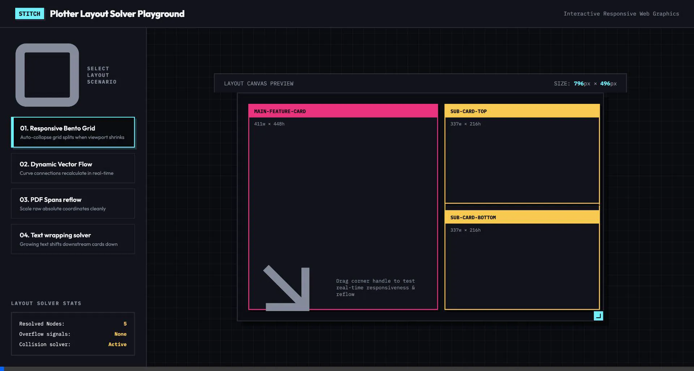
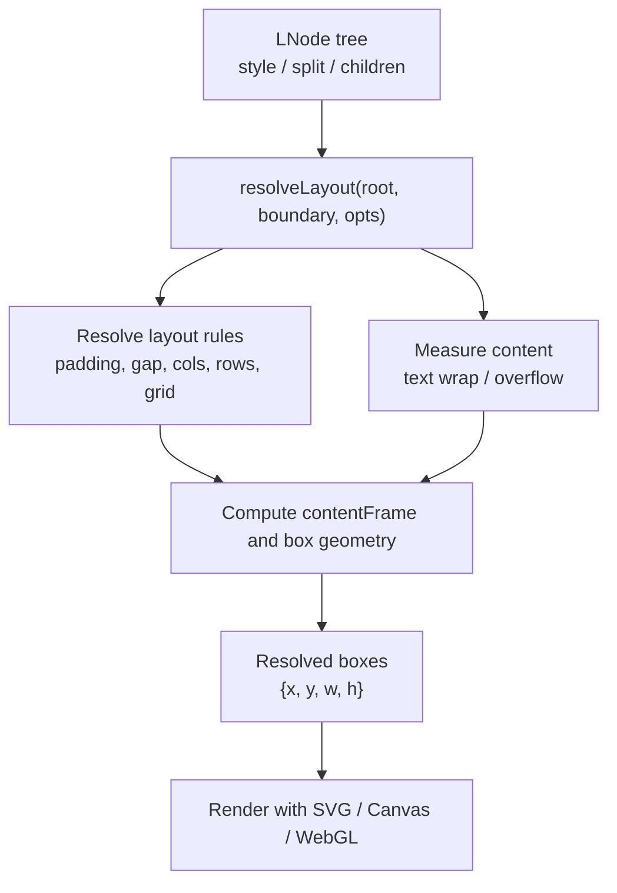
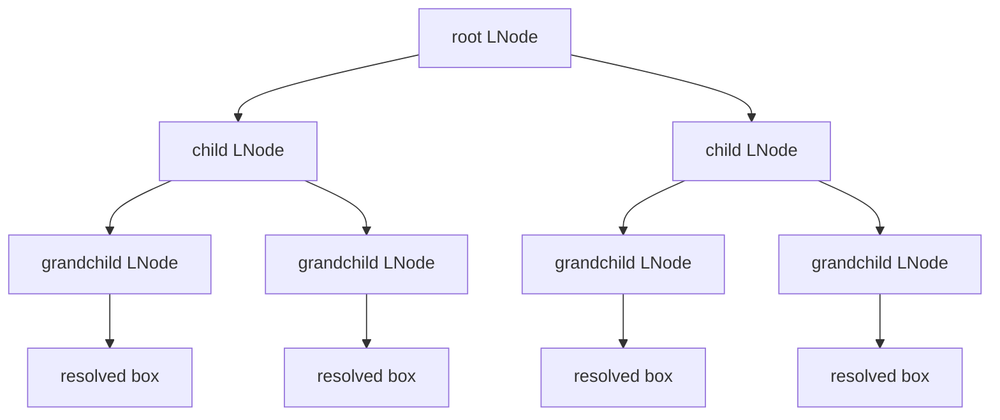

# Boxwood

[](https://www.npmjs.com/package/@canwork/boxwood) [](https://github.com/canwork/boxwood/actions/workflows/ci.yml) [](LICENSE)

A Declarative Box-Split and Collision Engine for Vector Graphics. It provides a CSS-like layout grammar (`padding`, `gap`, `cols`, `rows`, `auto-height`) and resolves it into a clean JSON coordinate tree for any visual canvas (SVG, `<canvas>`, WebGL).

Unlike typical layout libraries (like Yoga or standard web browsers) that hide resolved position values inside a black box, **Boxwood** exposes absolute coordinate geometry (`{x, y, w, h}`) directly. That makes it easy to draw responsive visuals, route connectors, and manage collision-safe compositions.

---


## Quick start

```bash
npm install @canwork/boxwood
```

```ts
import { resolveLayout, defaultMeasure, LNode } from "@canwork/boxwood";

const layoutTree: LNode = {
  style: { padding: 20 },
  split: { cols: ["60%", "40%"], gap: 15 },
  children: [
    { id: "main-panel", style: { w: "100%", h: "100%" } },
    {
      style: { w: "100%", h: "100%" },
      split: { rows: 2, gap: 10 },
      children: [
        { id: "sub-card-1", style: { padding: 12 } },
        { id: "sub-card-2", style: { padding: 12 } },
      ],
    },
  ],
};

const boundary = { x: 0, y: 0, w: 1920, h: 1080 };
const result = resolveLayout(layoutTree, boundary, { measure: defaultMeasure });
console.log(result.boxes);
```

## Layout flow at a glance





## Why Boxwood?

Boxwood is designed for developers who need a declarative layout model but also need the exact coordinates to render shapes, arrows, labels, and collision-aware content.

| Layout Library | Declarative Box Model | Coordinates for Lines/Arrows | Lightweight & Zero-DOM | Collision Separation |
| :--- | :---: | :---: | :---: | :---: |
| **Yoga / Flexbox** | ✅ Yes | ❌ No | ⚠️ Complex C++ bindings | ❌ No |
| **D3 / Cytoscape** | ❌ No | ✅ Yes | ✅ Yes | ⚠️ Force-directed |
| **Boxwood** | ✅ Yes | ✅ Yes | ✅ Yes | ✅ Yes |

### What Boxwood gives you

- Declarative layout rules for cols, rows, grids, gap, padding, margin, and auto sizing
- Absolute coordinate output ready for SVG, `<canvas>`, WebGL, or custom rendering
- Nested layout composition with resolved geometry for every node
- Text measurement and overflow-aware sizing via `measure`
- Collision resolution so layout boxes do not overlap unexpectedly

---

## Demo

Open `examples/interactive-demo.html` in your browser to see the engine running with a live resize demo.

---

## Core API & Types

### 1. Defining a Layout Tree (`LNode`)

Layouts are represented as a nested tree structure:

```typescript
import { LNode } from "@canwork/boxwood";

const layoutTree: LNode = {
  style: { padding: 20 },
  split: { cols: ["60%", "40%"], gap: 15 },
  children: [
    {
      id: "main-panel",
      style: { w: "100%", h: "100%" }
    },
    {
      style: { w: "100%", h: "100%" },
      split: { rows: 2, gap: 10 },
      children: [
        { id: "sub-card-1", style: { padding: 12 } },
        { id: "sub-card-2", style: { padding: 12 } }
      ]
    }
  ]
};
```

### 2. Resolving Layout Coordinates (`resolveLayout`)

Run the solver on your layout tree by passing the root node and the parent boundary dimensions:

```typescript
import { resolveLayout } from "@canwork/boxwood";

const boundary = { x: 0, y: 0, w: 1920, h: 1080 }; // 1080p frame
const result = resolveLayout(layoutTree, boundary);

console.log(result.boxes);
/*
Outputs a flat list of absolute coordinate boxes:
[
  { id: "main-panel", box: { x: 20, y: 20, w: 1128, h: 1040 } },
  { id: "sub-card-1", box: { x: 1163, y: 20, w: 737, h: 515 } },
  { id: "sub-card-2", box: { x: 1163, y: 545, w: 737, h: 515 } }
]
*/
```

---

## Drawing Layout Connections

Because **Boxwood** returns absolute coordinate values, routing arrows and lines between elements is simple:

```typescript
// Find the resolved boxes
const boxA = result.boxes.find(b => b.node.id === "sub-card-1")?.box;
const boxB = result.boxes.find(b => b.node.id === "sub-card-2")?.box;

if (boxA && boxB) {
  // Center coordinates of both boxes
  const x1 = boxA.x + boxA.w / 2;
  const y1 = boxA.y + boxA.h / 2;
  const x2 = boxB.x + boxB.w / 2;
  const y2 = boxB.y + boxB.h / 2;

  // Render SVG or Canvas lines using these points
  // e.g. <line x1={x1} y1={y1} x2={x2} y2={y2} stroke="gold" />
}
```

---

## Advanced Features

### 1. Dynamic Text Measurements & Font Sizing
You can pass custom measurement rules to child nodes using a `measure` hook. The engine will automatically evaluate if text fits inside a container. If text wraps or overflows, it raises a structured `OverflowSignal` in the solver result, letting you decrease font size or handle resizing programmatically.

### 2. Collision Separation Solver
When visual cards enter with scale spring animations, or dynamic data changes their sizes on the fly, Boxwood runs an overlap solver to push boxes apart, guaranteeing your nodes never overlap.

---

## Visual Examples & Use Cases

To showcase the responsiveness and design rules of the layout solver, we built a **Google Stitch Stark Brutalist Playground** in the `examples/` directory:

* **[interactive-demo.html](file:///Users/bonzai-carn/Documents/CanworkStudios/content-generator/storyboard/layout-engine/examples/interactive-demo.html)**: Open this file directly in any browser. It renders an interactive viewport with a corner drag-handle, running the layout solver in real-time as you scale or squeeze the container.

Additionally, we have prepared self-contained console scripts demonstrating each use case:

1. **`01-bento-grid.ts`**: Builds a dashboard-style "Bento box" grid with side-by-side splits and shows how it adapts dynamically between desktop and mobile portrait layout shapes.
2. **`02-vector-connections.ts`**: Demonstrates horizontal pipeline layout structures, retrieving coordinate boxes, and generating Bezier path coordinates to draw custom SVG connection arrows.
3. **`03-absolute-to-responsive.ts`**: Illustrates how to take a set of static, absolute coordinate elements (e.g. from PDF.js) and wrap them into a responsive Boxwood column grid.
4. **`04-dynamic-reflow-overflow.ts`**: Walks through the dynamic text measurement system, showing how text wraps and shifts downstream sibling cards downwards to prevent overlap, alongside emitting overflow alerts.

---

## License

MIT © Canwork Studios
